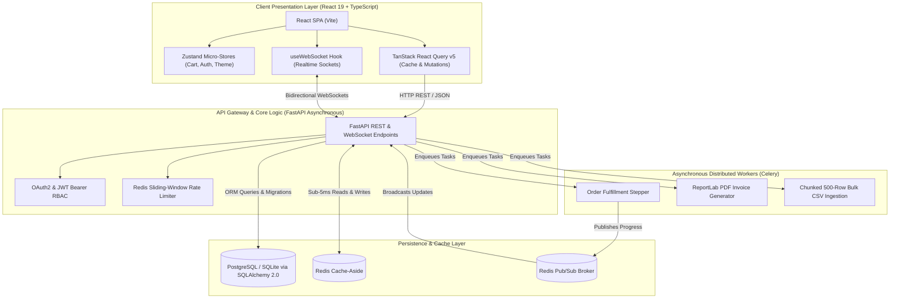

# Coastal Seven Daily Tasks — Enterprise Full-Stack E-Commerce Platform

<p align="center">
  
  
  
  
  
  
  
  
  
  
  
  
  
  
  
  
  
  
  
</p>

---

## 📖 Executive Summary

**Coastal Seven Daily Tasks** is a complete, production-grade enterprise full-stack software engineering curriculum tracking progress from **Day 01 through Day 18**. 

The repository demonstrates a scalable journey from core algorithmic Python scripting and relational database architecture to an asynchronous, distributed full-stack E-Commerce platform (**R-Mart**) featuring **FastAPI**, **SQLAlchemy 2.0**, **PostgreSQL (Neon)**, **Redis Cache & Pub/Sub**, **Celery Asynchronous Workers**, **ReportLab PDF Invoices**, **Chunked Bulk CSV Import Pipelines**, **React 19 + TypeScript**, **Zustand State Management**, **TanStack React Query v5**, **Bidirectional WebSockets**, and automated quality assurance across **Pytest**, **Vitest**, and **Playwright**.

---

## 🏗️ System Architecture & Data Flow



---

## 🛠️ Tools, Libraries & Frameworks Matrix

| Domain | Technology / Tool | Version | Purpose in Architecture |
| :--- | :--- | :--- | :--- |
| **Backend Framework** | **FastAPI** | `0.115+` | Asynchronous high-throughput RESTful API & WebSocket gateway |
| **ASGI Web Server** | **Uvicorn** | `0.30+` | ASGI web server with event loop and hot reloading |
| **Primary Language** | **Python** | `3.11+` | Core algorithmic and backend development |
| **Relational Database** | **PostgreSQL (Neon)** | Serverless | Cloud-native serverless relational database with pooling |
| **Local Database** | **SQLite** | `3.x` | Lightweight local and testing relational database engine |
| **ORM & Migrations** | **SQLAlchemy 2.0 & Alembic** | `2.0.30+` | Declarative models, relationship mapping, $N+1$ optimization, schema versioning |
| **Database Driver** | **psycopg / psycopg2** | `3.x` | High-performance PostgreSQL database adapter |
| **Cache & Pub/Sub** | **Redis** | `5.0+` | Cache-aside catalog storage, sliding-window rate limiters, WebSocket pub/sub |
| **Background Tasks** | **Celery** | `5.4+` | Distributed task queue handling bulk CSV imports, fulfillment, and invoices |
| **Document Generation** | **ReportLab** | `4.2+` | Programmatic PDF commercial invoice generation with itemized tables |
| **Image Processing** | **Pillow (PIL)** | `10.3+` | Asynchronous thumbnail downscaling (300x300 px) and format validation |
| **Frontend Framework** | **React** | `19.2+` | Modern component architecture and UI presentation |
| **Type System** | **TypeScript** | `5.x` | Strict type definitions, interfaces, and compiler validation |
| **Build Tool & HMR** | **Vite** | `8.3+` | Sub-second Hot Module Replacement and production bundling |
| **State Management** | **Zustand** | `5.0+` | Atomic client state micro-stores with local storage persistence |
| **Server State & Cache**| **TanStack React Query** | `v5` | Background query caching, optimistic mutations, infinite scroll |
| **Utility Styling** | **Tailwind CSS & PostCSS** | `4.3+` | Utility-first responsive styling and dark mode theming |
| **Form Management** | **React Hook Form & Zod** | `7.89+` / `3.25+` | High-performance uncontrolled form state and strict schema validation |
| **Icons & Drag-and-Drop**| **Lucide React & Dropzone**| `1.49+` / `20.1+` | Iconography and accessible drag-and-drop media ingestion |
| **Real-Time Sockets** | **WebSockets (Native & Starlette)**| Built-in | Bidirectional live order tracking, chat, and notification streams |
| **Unit & Integration Test**| **Pytest & Pytest-Asyncio** | `8.0+` | Backend automated test suites (21 Day-10 tests + 34 Day-18 tests) |
| **Component Testing** | **Vitest & RTL** | `5.0+` | Frontend unit/component testing with React Testing Library |
| **Network Mocking** | **MSW (Mock Service Worker)** | `2.x` | Offline declarative HTTP mocking for component isolation |
| **End-to-End Testing** | **Playwright** | `1.48+` | Cross-browser automated user journeys and live UI flows |
| **CI/CD Automation** | **GitHub Actions** | `v4` | Automated continuous integration test matrix across backend and frontend |

---

## 📊 Comprehensive Progress Tracker Table (Days 01–18)

| Day | Module / Focus | Topics & Core Architecture | Key Deliverables & Test Verification | Feature Branch | Status |
| :---: | :--- | :--- | :--- | :--- | :---: |
| **Day 01** | **Python & FastAPI Fundamentals** | Python data types, loops, functions, FastAPI app instance, Swagger UI | Interactive Student Management CRUD API with Pydantic validation | `feature/day-01-python-fastapi` |  |
| **Day 02** | **Python Control Flow & Data Structures** | Modulo algorithms, primality tests, nested collections, file I/O | Persistent Contact Book CLI with JSON storage and CSV export | `feature/day-02-python-foundations` |  |
| **Day 03** | **OOP Principles & Python Data Model** | Classes, encapsulation, dunder methods, inheritance, polymorphism, ABC | Defensive Bank Account, Abstract contracts, property decorators | `feature/day-03-oop-principles` |  |
| **Day 04** | **PostgreSQL & CLI Task Manager** | Neon PostgreSQL serverless, psycopg connection pooling, relational DDL | Parameterized SQL Task Manager with JSON export and Pytest suite | `feature/day-04-cli-task-manager` |  |
| **Day 05** | **SQLAlchemy ORM & Alembic** | SQLAlchemy 2.0 models, repository CRUD pattern, Alembic migrations | Layered REST API with automated database migrations and tests | `feature/day-05-fastapi-sqlalchemy` |  |
| **Day 06** | **JWT Authentication & RBAC** | Password hashing (Bcrypt), JWT creation/decode, role dependencies | Secure Auth subsystem with OAuth2 password flow and admin route gating | `feature/day-06-jwt-rbac` |  |
| **Day 07** | **Task Management Production API** | Multi-tenant projects, task status lifecycle (`TODO` → `DONE`), CORS | Modular Project & Task Management API with JWT RBAC | `feature/day-07-task-mgmt-jwt-redis` |  |
| **Day 08** | **High-Performance FastAPI, Redis & Celery**| `asyncio.gather` concurrency, Redis cache-aside, ZSET rate limiter | Sub-5ms cached reads, 429 rate-limiting, Celery report jobs | `feature/day-08-fastapi-redis-celery` |  |
| **Day 09** | **File Ingestion, Pillow & WebSockets** | Streaming `UploadFile`, MIME validation, Pillow 300x300 thumbnails | Resilient image upload pipeline with WebSocket alerts and 95% test coverage | `feature/day-09-file-processing-websockets` |  |
| **Day 10** | **E-Commerce Backend & Celery Tasks** | E-commerce schema, cart quantity stacking, Redis Pub/Sub, live tracking | Production FastAPI backend, 21-test Pytest suite (100% passed) | `feature/day-10-ecommerce-backend` |  |
| **Day 11** | **React Frontend Integration & Admin Ops** | Vite + React SPA, React Router v6, Context API auth, protected routes | Interactive shopping cart, live stepper, and admin metrics portal | `feature/day-11-react-frontend-integration` |  |
| **Day 12** | **Tailwind CSS, Shadcn/ui & Zod Validation**| Tailwind design system, dark mode, React Hook Form + Zod schemas | Multi-step checkout wizard with accessible dropzone file upload | `feature/day-12-tailwind-shadcn-forms` |  |
| **Day 13** | **E-Commerce Frontend Part 1** | Real-time search/filters/sort, `/catalog/:id` view, dual-mode auth | Amazon/Flipkart cart drawer, Admin Studio with 3-way image upload | `feature/day-13-ecommerce-frontend-part1` |  |
| **Day 14** | **State Management, React Query & 3D Motion**| Zustand micro-stores, TanStack Query v5, Canvas 3D space warp, Audio API| Optimistic stock mutations, interactive tilt cards, 99+ Lighthouse score | `feature/day-14-state-query-performance` |  |
| **Day 15** | **TypeScript Strict Typing & Testing Matrix**| TypeScript interfaces, Vitest component tests, MSW offline mocking | Strict typing, 5 Vitest tests, Playwright cross-browser user journeys | `feature/day-15-typescript-testing` |  |
| **Day 16** | **Frontend Part 2 & Automated Quality Matrix**| Zustand cart persistence, Zod checkout validation, Admin CRUD | 25 Vitest tests passed, 13 Playwright E2E scenarios, 100% CI pass | `feature/day-16-ecommerce-frontend-part2` |  |
| **Day 17** | **Full-Stack Real-Time WebSockets & Tracking**| Bidirectional WebSockets, Redis Pub/Sub broadcast, `useWebSocket` hook | Live delivery tracking stepper, 24/7 customer support chat, alerts drawer | `feature/day-17-fullstack-websockets-tracking` |  |
| **Day 18** | **Background Tasks, PDF Invoices & Bulk CSV** | Celery polling, ReportLab PDF invoices, 500-row chunked CSV imports | Multi-token search, N+1 query optimization, 34-test Pytest suite | `feature/day-18` |  |

---

## 🌿 Day-to-Day Git Branch Mapping

Every milestone in this repository is isolated into its own cleanly structured feature branch:

| Milestone | Git Feature Branch | Switch Command |
| :--- | :--- | :--- |
| **Day 01** | `feature/day-01-python-fastapi` | `git checkout feature/day-01-python-fastapi` |
| **Day 02** | `feature/day-02-python-foundations` | `git checkout feature/day-02-python-foundations` |
| **Day 03** | `feature/day-03-oop-principles` | `git checkout feature/day-03-oop-principles` |
| **Day 04** | `feature/day-04-cli-task-manager` | `git checkout feature/day-04-cli-task-manager` |
| **Day 05** | `feature/day-05-fastapi-sqlalchemy` | `git checkout feature/day-05-fastapi-sqlalchemy` |
| **Day 06** | `feature/day-06-jwt-rbac` | `git checkout feature/day-06-jwt-rbac` |
| **Day 07** | `feature/day-07-task-mgmt-jwt-redis` | `git checkout feature/day-07-task-mgmt-jwt-redis` |
| **Day 08** | `feature/day-08-fastapi-redis-celery` | `git checkout feature/day-08-fastapi-redis-celery` |
| **Day 09** | `feature/day-09-file-processing-websockets` | `git checkout feature/day-09-file-processing-websockets` |
| **Day 10** | `feature/day-10-ecommerce-backend` | `git checkout feature/day-10-ecommerce-backend` |
| **Day 11** | `feature/day-11-react-frontend-integration` | `git checkout feature/day-11-react-frontend-integration` |
| **Day 12** | `feature/day-12-tailwind-shadcn-forms` | `git checkout feature/day-12-tailwind-shadcn-forms` |
| **Day 13** | `feature/day-13-ecommerce-frontend-part1` | `git checkout feature/day-13-ecommerce-frontend-part1` |
| **Day 14** | `feature/day-14-state-query-performance` | `git checkout feature/day-14-state-query-performance` |
| **Day 15** | `feature/day-15-typescript-testing` | `git checkout feature/day-15-typescript-testing` |
| **Day 16** | `feature/day-16-ecommerce-frontend-part2` | `git checkout feature/day-16-ecommerce-frontend-part2` |
| **Day 17** | `feature/day-17-fullstack-websockets-tracking` | `git checkout feature/day-17-fullstack-websockets-tracking` |
| **Day 18** | `feature/day-18` | `git checkout feature/day-18` |

---

## 📁 Repository Directory Structure

```text
coastal-seven-daily-tasks/
├── .github/workflows/ci.yml # Automated CI matrix (Days 10-16)
├── .gitignore              # Standardized Git exclusion rules
├── LICENSE                 # Project license
├── README.md               # Master curriculum documentation (This file)
├── requirements.txt        # Shared project Python dependencies
│
├── Day-01/                 # Python basics & FastAPI Student API
├── Day-02/                 # Algorithmic loops, data structures, Contact Book CLI
├── Day-03/                 # Object-Oriented Programming (OOP) in Python
├── Day-04/                 # Cloud Neon PostgreSQL & CLI Task Manager
├── Day-05/                 # SQLAlchemy 2.0 ORM, Alembic migrations & modular CRUD
├── Day-06/                 # JWT Authentication & Role-Based Access Control (RBAC)
├── Day-07/                 # Production Task Management API with JWT Auth
├── Day-08/                 # High-performance async FastAPI, Redis & Celery
├── Day-09/                 # File uploads, Pillow 300x300 thumbnails & WebSockets
├── Day-10/                 # E-Commerce backend, cart stacking, Redis & 21 Pytest tests
├── Day-11/                 # React SPA frontend, React Router v6 & Context API
├── Day-12/                 # Tailwind CSS, Shadcn/ui & Zod multi-step checkout
├── Day-13/                 # Catalog browsing, drawer navigation & Admin Studio
├── Day-14/                 # Zustand micro-stores, TanStack Query v5 & 3D Motion
├── Day-15/                 # TypeScript strict typing, Vitest & Playwright E2E
├── Day-16/                 # Frontend Part 2, Zustand cart & 40-test quality matrix
├── Day-17/                 # Full-stack real-time WebSockets, live tracking & chat
└── Day-18/                 # Celery async polling, ReportLab PDF, bulk CSV, 34 Pytests
```

---

## 🚀 Quickstart & Execution Guide

### 1. Prerequisites
- **Python**: 3.11+
- **Node.js**: 20+
- **Redis Server**: Local or cloud instance (`redis://localhost:6379/0`)

### 2. Python Environment Setup
```bash
# Clone the repository
git clone https://github.com/RehanaG7/coastal-seven-daily-tasks.git
cd coastal-seven-daily-tasks

# Create and activate Python virtual environment
python -m venv venv
# Windows:
.\venv\Scripts\activate
# Linux/macOS:
source venv/bin/activate

# Install dependencies
pip install -r requirements.txt
```

### 3. Running Day-18 Full-Stack Platform

#### Terminal A: FastAPI Backend
```bash
cd Day-18/backend
uvicorn main:app --reload --port 8000
```
*Interactive Swagger UI: `http://127.0.0.1:8000/docs`*

#### Terminal B: Celery Worker
```bash
cd Day-18/backend
celery -A tasks.celery_app.celery_app worker --loglevel=info
```

#### Terminal C: React 19 Frontend
```bash
cd Day-18
npm install
npm run dev
```
*Client Application: `http://localhost:5173`*

---

## 🧪 Automated Testing Matrix

Run the comprehensive test suites across the repository:

```bash
# Day-10 Backend Suite (21 Tests)
cd Day-10
pytest -v tests

# Day-18 Backend Suite (34 Tests)
cd Day-18/backend
pytest -v tests

# Day-15 Frontend TypeScript & Vitest Suite (5 Tests)
cd Day-15
npx tsc --noEmit && npx vitest run

# Day-16 Frontend Vitest Suite (25 Tests)
cd Day-16
npx tsc --noEmit && npx vitest run
```
